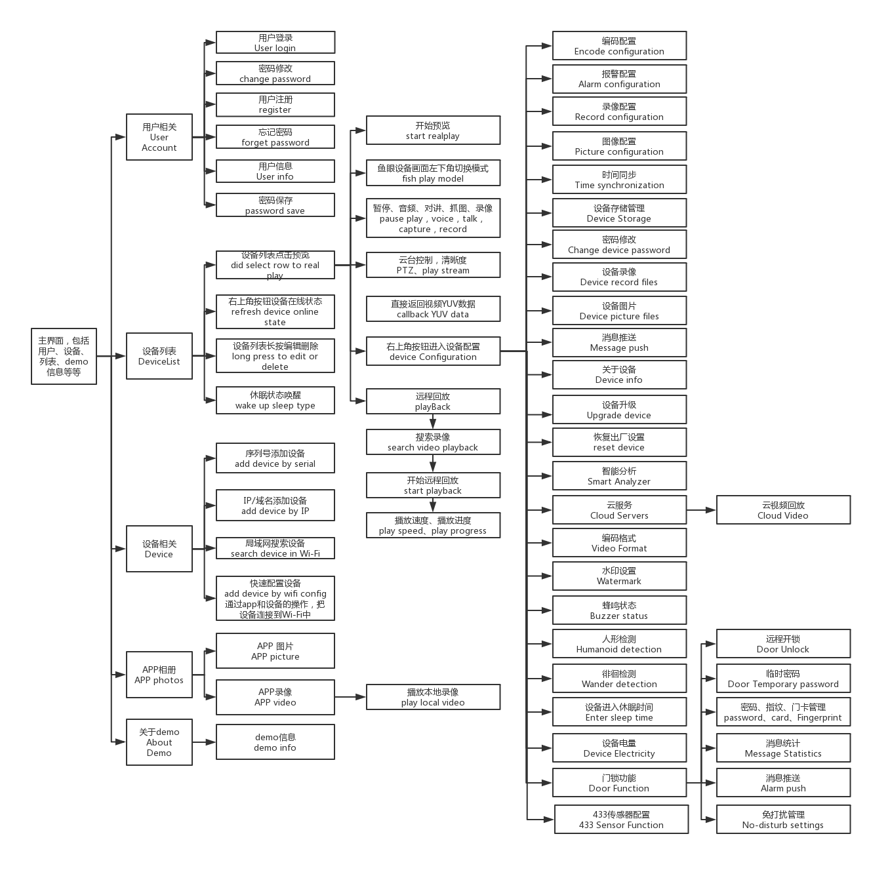

# FunSDKDemo_iOS
FunSDKDemo for iOS （Real machine mode，not simulator）

## Development Environment

|System |Minimum Version|
|--|--|
|Mac OS | 10.13.6|
|XCODE | 9.4.1|

## Preparation
Before using the FunSDKDemo for the first time, please log in to the Xiongmai Open Platform at http://docs-open.xmeye.net/#/, and carefully read the beginner's guide and all instructions.

 ## Create application on the open platform
 To create an application on the open platform:
When developing with FunSDKDemo, you need to register and log in on the Xiongmai Open Platform. Then, go to the Application Center to add an application. Each app corresponds to a unique set of platform information. After that, search for the following method in the demo:
FUN_XMCloundPlatformInit(UUID, APPKEY, APPSECRET, MOVECARD);
Once you find this unique method, replace the parameters in the method with the details of your added mobile application. If you skip this step, various issues may arise during subsequent use.
	
## FunSDKDemo Flowchart

The program's functional interface and operational workflow can be referred to in the FunSDKDemo chart.pdf

## Additional Instructions

1. The demo supports only real device debugging, please replace the certificate on your own. If an error occurs during runtime and FunSDK.a is not found, please remove the reference to .a and search for FunSDK.framework in the files, then add the reference.

2. If you encounter callback methods not being called during the development process, please check: 1. Whether the SDK is initialized. 2. Whether the request parameters are correct. 3. Whether the object containing the callback method has been released. 4. Whether the callback method name is spelled correctly, and so on.

3. Starting from iOS 14.5, it is necessary to apply for broadcast permissions to perform quick network configuration for monitoring devices. The application can be submitted at: https://developer.apple.com/contact/request/networking-multicast (Reason for application: Due to the quick network configuration process, the app encrypts and broadcasts WiFi information. When the device receives the broadcast packet, it decodes the WiFi information and connects to WiFi, facilitating the device setup. However, after iOS 14.5, Apple has restricted the broadcast packet transmission and reception functions, causing apps to be unable to perform device setup. Therefore, it is necessary to apply for broadcast permissions.)

4. If you want to develop quickly and simply, and you don't have a customized server or other special functionalities, you can directly develop the ViewController. Follow the calling method in the demo to directly invoke various functions of managers and control classes.

5. If there is a customized server and other special functionalities, it may be necessary to make some modifications based on the customization requirements (for example, replacing the underlying library that supports custom content or passing the customized server address during server initialization, etc.).

6. If there is a functionality not present in the demo, you can first attempt to develop it based on the protocol. If you encounter difficulties or are unable to implement it, you can contact us, and we will provide support in development and assess whether it is necessary to add this functionality to the demo.

7. For more detailed functionality instructions, please refer to the open guide: http://docs-open.xmeye.net/#/FunSDKDevelopmentGuide/FunSDKDevelopmentGuide-iOSIntegration"For more detailed functionality instructions, please refer to the open guide: http://docs-open.xmeye.net/#/FunSDKDevelopmentGuide/FunSDKDevelopmentGuide-iOSIntegration"

